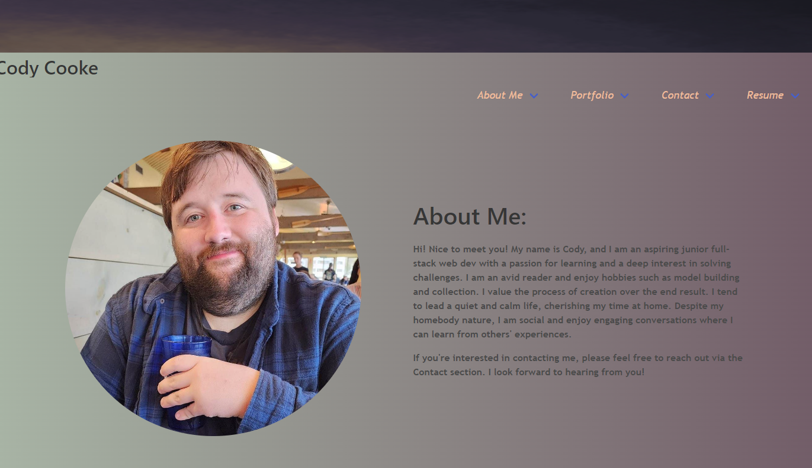
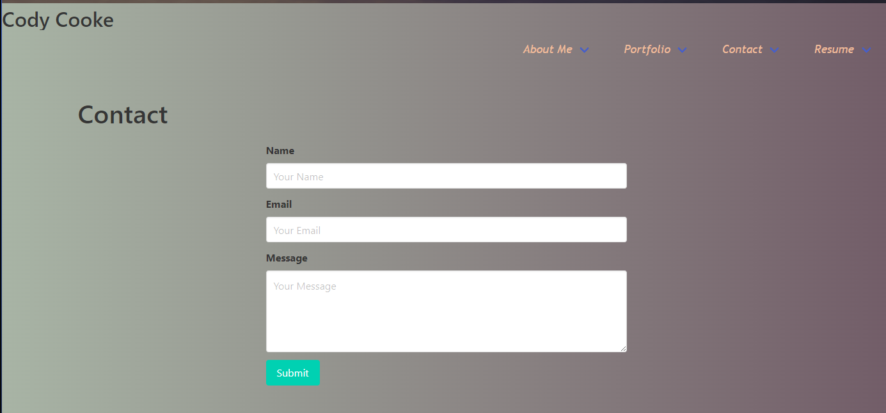
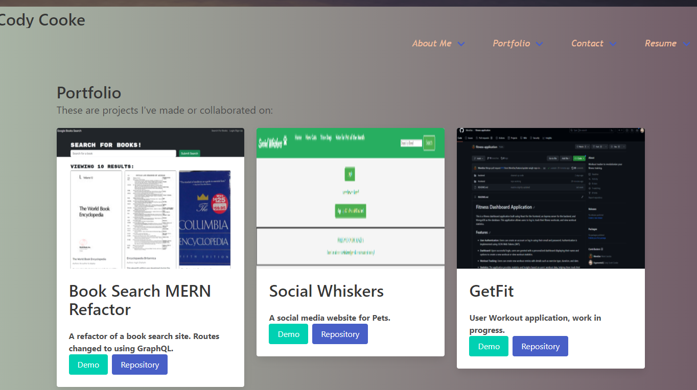
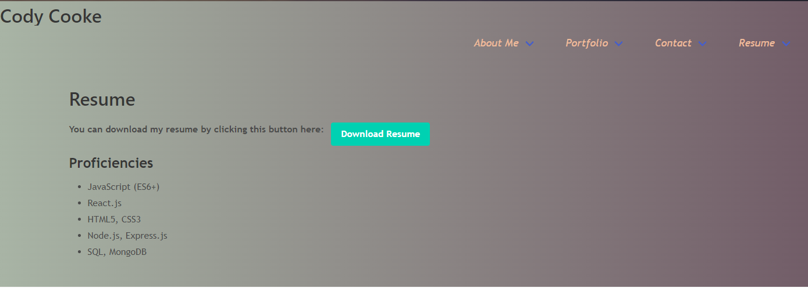

# React Front-End Portfolio
  

  ## Description
  This a protfolio demonstrating the use of React components to construct a professional looking website for a junior dev. 
  
  ## Table of Contents
  - [Installation](#installation)
  - [Usage](#usage)
  - [License](#license)
  - [Contributing](#contributing)
  - [Questions](#questions)
  
  ## Installation
  Installation is not needed, however, if you want to, Once you've cloned this repo, you can type npm i to install the needed dependencies, and from there you can type npm start to view the site inbrowser. 
  
  ## Usage
  You can use any preferred code editor of you choice, I use VSCode.

  ## License
 This project is licensed under the [MIT](https://opensource.org/licenses/MIT) license.
  
  ## Contributing
  The following documentation for bulma and React can be found below.
  
  
  ## Questions
  if you have any questions, you can reach me @ [ergonomicQ](https://github.com/ergonomicQ) or shoot me email at c.s.cooke89@gmail.com.
  